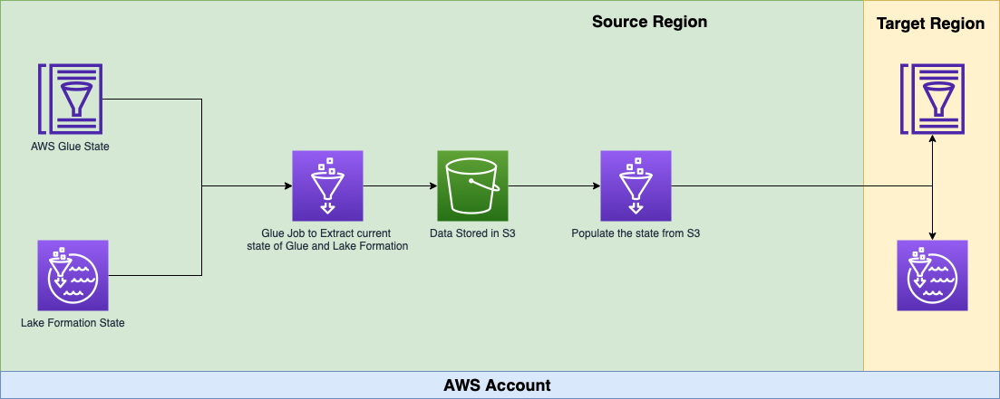
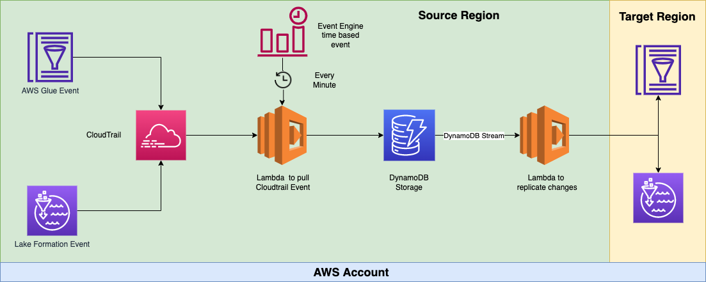
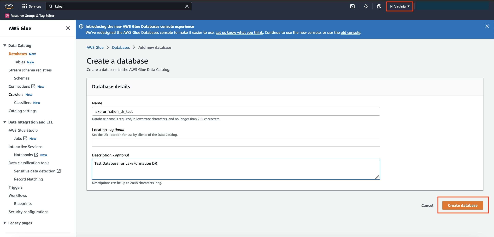

# Glue Catalog and Lake Formation Permissions replication 

This utility is developed to create alternate backup of Glue Catalog objects and LakeFormation permissions and replicate to a target region. 
There are two modes of this backup process.

## Prerequisites
- Install [AWS CLI](https://aws.amazon.com/cli/).
- Install [AWS CDK](https://aws.amazon.com/cdk/).
- Install [Python](https://www.python.org/downloads/).
- An AWS account for use with deployment and testing.
- Updated [configuration file](./realtime/lf-dr-cdk/config/glue-lf-config.conf) with options to customize Lake Formation restore from a source region to a target region. Once you upload your configuration file to an S3 bucket, make note of the configuration S3 bucket name and the backup file bucket name specified in the configuration file.

## Batch Mode
 
 This mode is suitable for creating a replica of existing Glue objects and LakeFormation permissions



## Prerequisites for Batch mode
- Updated [configuration file](./batch/glue_config.conf) with options to customize Lake Formation restore from a source region to a target region. See this [`description`](#configuration-options) for deatils about the configuration options. Once you upload your configuration file to an S3 bucket, make note of the configuration S3 bucket name and the backup file bucket name specified in the configuration file. 


## Realtime Mode

 This mode is suitable for replicating ongoing changes once the existing setup is in sync with the target region. The source and target regions can be defined in [configuration file](./realtime/lf-dr-cdk/config/glue-lf-config.conf)



Currently the following events are replicated via this changes:

- BatchRevokePermissions,  
- BatchGrantPermissions,   
- CreateLFTag,
- DeleteLFTag ,
- GrantPermissions,   
- RevokePermissions,  
- CreateDatabase,   
- DeleteDatabase,
- UpdateDatabase,
- CreateTable,
- BatchCreatePartition,
- UpdateTable,
- DeleteTable,  
- RegisterResource,
- PutDataLakeSettings,    
- AddLFTagsToResource,

The following event is not supported due to associated Cloudtrail request limitations. 

- CreateDataCellsFilter

This project creates the following objects:

 * A Lambda function to pull records from Cloudtrail
 * An event rule to run the lambda function above every one minute
 * A DynamoDB table to store pulled Cloudtrail records for Lakeformation and Glue service for request where an object is modified successfully
 * A Lambda function to process these DynamoDB streamed records
 * Lambda role to pull Cloudtrail records, insert data in the DynamodDB table and the replicate changes in Glue and LakeFormation
 * TODO : SNS notification for failures

## Prerequisites for Realtime mode
- Updated [configuration file](./realtime/lf-dr-cdk/config/glue-lf-config.conf) with options to customize Lake Formation restore from a source region to a target region. See this [`description`](#configuration-options) for deatils about the configuration options.

## Deployment
- [Configure AWS CLI in your source region](https://docs.aws.amazon.com/cli/latest/userguide/cli-chap-configure.html).
- [Bootstrap AWS CDK in your source region](https://docs.aws.amazon.com/cdk/v2/guide/bootstrapping.html).
- From the command line, clone this repository using "git clone url" where "url" can be found when you click the "Clone" button on this repository.
- Change directory to the newly cloned project.

The `cdk.json` file tells the CDK Toolkit how to execute your app.

This project is set up like a standard Python project.  The initialization
process also creates a virtualenv within this project, stored under the .env
directory.  To create the virtualenv it assumes that there is a `python3`
(or `python` for Windows) executable in your path with access to the `venv`
package. If for any reason the automatic creation of the virtualenv fails,
you can create the virtualenv manually.

To manually create a virtualenv on MacOS and Linux:

```
$ python -m venv .env
```

After the init process completes and the virtualenv is created, you can use the following
step to activate your virtualenv.

```
$ source .env/bin/activate
```

If you are a Windows platform, you would activate the virtualenv like this:

```
% .env\Scripts\activate.bat
```

Once the virtualenv is activated, you can install the required dependencies.

```
$ pip install -r requirements.txt
```

### CDK stack Deployment
At this point you can now start deployment of CDK code.


**Step 1: Navigate to location 
```~/lake-formation-permissions-sync/realtime/lf-dr-cdk/```. 
Initialize AWS CDK for first time only. If AWS CDK is already initialized then skip to Step 2.**

Option 1: With default AWS profile
```
cdk bootstrap --context config_file_key="config/glue-lf-config.conf" --context config_file_bucket="lf-metadata-artifact-bucket" --context target_region="us-west-2" --context eventbridge_schedule_min="1" --all
```

Option 2: With passing AWS profile name:
```
cdk bootstrap --profile <aws_profile> --context config_file_key="config/glue-lf-config.conf" --context config_file_bucket="lf-metadata-artifact-bucket" --context target_region="us-west-2" --context eventbridge_schedule_min="1" --all
```

Replace the config_file_key, config_file_bucket (s3 bucket where config file can be placed), target_region and eventbridge_schedule_min values with your preferred settings.

**Step 2: Deploy CDK stack with following command:**

Option 1: With default AWS profile
```
cdk deploy --context config_file_key="config/glue-lf-config.conf" --context config_file_bucket="lf-metadata-artifact-bucket" --context target_region="us-west-2" --context eventbridge_schedule_min="1" --all
```

Option 2: With passing AWS profile name:
```
cdk deploy --profile <aws_profile> --context config_file_key="config/glue-lf-config.conf" --context config_file_bucket="lf-metadata-artifact-bucket" --context target_region="us-west-2" --context eventbridge_schedule_min="1" --all 
```
Replace the config_file_key, config_file_bucket (s3 bucket where config file can be placed), target_region and eventbridge_schedule_min values with your preferred settings.

**Step 3: Clean up**

Option 1: With default AWS profile
```
cdk destroy --context config_file_key="config/glue-lf-config.conf" --context config_file_bucket="lf-metadata-artifact-bucket" --context target_region="us-west-2" --context eventbridge_schedule_min="1" --all
```

Option 2: With passing AWS profile name:
```
cdk destroy --profile <aws_profile> --context config_file_key="config/glue-lf-config.conf" --context config_file_bucket="lf-metadata-artifact-bucket" --context target_region="us-west-2" --context eventbridge_schedule_min="1" --all
```

Replace the config_file_key, config_file_bucket (s3 bucket where config file can be placed), target_region and eventbridge_schedule_min values with your preferred settings.

You’ll be asked:
```
Are you sure you want to delete: CdkWorkshopStack (y/n)?
```
Hit “y” and you’ll see your stack being destroyed.

The bootstrapping stack created through ```cdk bootstrap``` still exists. If you plan on using the CDK in the future (we hope you do!) do not delete this stack.

If you would like to delete this stack, it will have to be done through the CloudFormation console. Head over to the CloudFormation console and delete the ```CDKToolkit``` stack. The S3 bucket created will be retained by default, so if you want to avoid any unexpected charges, be sure to head to the S3 console and empty + delete the bucket generated from bootstrapping.


## Testing (optional)

The following steps are only to test the setup. 

### Steps to replicate Glue Objects and LakeFormation Permissions

1. Create a Database in the source region from AWS Glue console. In this testing scenario, we have used us-east-1 (N. Virginia) as the source region. The source and target region can be configured in the [configuration file](./realtime/lf-dr-cdk/config/glue-lf-config.conf) along with S3 bucket mapping.




2. Check DynamoDB Table ```glue_lf_events``` to check if event is created for CreateDatabase in the source region. Note that the Processed flag is set to Y. This indicates that the database has been replicated in the target region. 


3. Check the replicated database in the target region.


## Useful commands

 * `cdk ls`          list all stacks in the app
 * `cdk synth`       emits the synthesized CloudFormation template
 * `cdk deploy`      deploy this stack to your default AWS account/region
 * `cdk diff`        compare deployed stack with current state
 * `cdk docs`        open CDK documentation

FAQ:
- Can I replicate the changes to another account?

  LakeFormation permissions are highly coupled with the IAM roles and permissions. 
  To ensure exact replication of changes this utility does not modify the original request and if the target region does not have
  the role with same name and permissions then the grants will fail, that's the reason the execution of the utility is limited to an account only. 
  The raw requests are always available to extend to beyond one account if the underlying permissions are managed.
- How can I report of bugs or request enhancement?

  The utility is in the active developement. If you encounter any bugs or request enhancements, please communicate through the issues and it will be addressed. 


